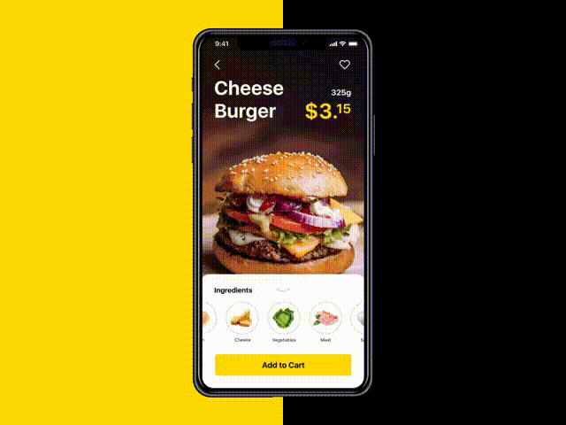

# Hamburger Flutter
App concept created with [Flutter](https://flutter.dev/) inspired by [Tasty Burger](https://dribbble.com/shots/4038053-Tasty-Burger-App). 

## About
The app was created to simulate all the system behind the inspiration video. There's no code on the backend or another web service. The app is all contained in this repository. The model's classes were created to better represent an official development, the repositories classes are simulating a web request. I'm using BLOC pattern as an architectural pattern.

## The App
The GIF below shows this current app runnig.

## The Inspiration
The GIF below shows the inspiration concept app.

### Notes
This code was build in a few hours within 3 days, so there's still some small things to complete. There's no Cart, Profile, or Favorite screen on the inspiration video, so i created the Cart screen myself.

